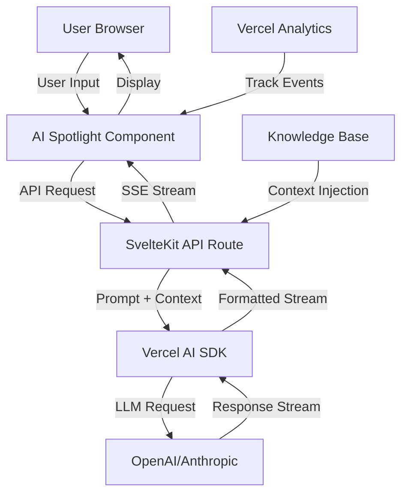

# Design Document: AI Spotlight Component

## Overview

The AI Spotlight Component is an interactive chatbot interface that replaces the Rico's World Kitchen portfolio image in the hero section. It leverages Vercel's AI SDK to provide real-time, context-aware responses about TechieNeighbor's services. The component uses a knowledge base derived from the project's documentation to answer visitor questions about web development, smart home automation, local SEO, and other services.

The component features a glassmorphic design consistent with TechieNeighbor's brand aesthetic, with teal accent colors and smooth animations. It supports streaming responses for a modern, responsive user experience.

## Architecture

### High-Level Architecture



### Component Hierarchy

```
AI Spotlight Component
├── Chat Bubble (Collapsed State)
│   ├── Icon/Avatar
│   ├── Pulse Animation
│   └── Tooltip
├── Chat Interface (Expanded State)
│   ├── Header
│   │   ├── Title
│   │   └── Close Button
│   ├── Message Container
│   │   ├── Welcome Message
│   │   ├── Suggested Questions
│   │   ├── Message History
│   │   │   ├── User Messages
│   │   │   └── AI Messages (Streaming)
│   │   └── Loading Indicator
│   └── Input Area
│       ├── Text Input
│       └── Send Button
```

## Components and Interfaces

### 1. AISpotlight.svelte (Main Component)

**Purpose**: Root component managing state and orchestrating the chat interface.

**State Management**:
```typescript
interface ChatMessage {
  id: string;
  role: 'user' | 'assistant' | 'system';
  content: string;
  timestamp: Date;
}

interface ComponentState {
  isExpanded: boolean;
  messages: ChatMessage[];
  isLoading: boolean;
  error: string | null;
  inputValue: string;
}
```

**Key Methods**:
- `toggleExpanded()`: Toggle between collapsed bubble and expanded chat interface
- `sendMessage(content: string)`: Send user message and initiate AI response
- `handleStream(response: ReadableStream)`: Process streaming AI responses
- `selectSuggestedQuestion(question: string)`: Handle suggested question clicks
- `trackInteraction(event: string, data: object)`: Track analytics events

### 2. ChatBubble.svelte (Collapsed State)

**Purpose**: Displays the collapsed chat bubble with attention-grabbing animations.

**Props**:
```typescript
interface ChatBubbleProps {
  onClick: () => void;
  isVisible: boolean;
}
```

**Features**:
- Glassmorphic styling with teal gradient
- Subtle pulse animation to draw attention
- Tooltip on hover: "Ask me about our services"
- AI sparkle icon

### 3. ChatMessage.svelte (Message Display)

**Purpose**: Renders individual chat messages with appropriate styling.

**Props**:
```typescript
interface ChatMessageProps {
  message: ChatMessage;
  isStreaming: boolean;
}
```

**Features**:
- Different styling for user vs AI messages
- Markdown rendering for AI responses
- Typing indicator for streaming responses
- Timestamp display

### 4. SuggestedQuestions.svelte (Question Chips)

**Purpose**: Displays clickable suggested questions for user onboarding.

**Props**:
```typescript
interface SuggestedQuestionsProps {
  questions: string[];
  onSelect: (question: string) => void;
  isVisible: boolean;
}
```

**Default Questions**:
1. "How can local AI document processing help my small business?"
2. "How can a modern website with integrated analytics help our marketing team gain insight?"
3. "What smart home automation services do you offer in Gwinnett County?"

### 5. API Route: /api/ai-chat/+server.ts

**Purpose**: Server-side endpoint handling AI requests and streaming responses.

**Request Interface**:
```typescript
interface ChatRequest {
  message: string;
  conversationHistory: ChatMessage[];
}
```

**Response**: Server-Sent Events (SSE) stream

**Implementation**:
```typescript
import { OpenAIStream, StreamingTextResponse } from 'ai';
import { Configuration, OpenAIApi } from 'openai-edge';
import { KNOWLEDGE_BASE } from '$lib/knowledge-base';

export async function POST({ request }) {
  const { message, conversationHistory } = await request.json();
  
  // Build system prompt with knowledge base
  const systemPrompt = buildSystemPrompt(KNOWLEDGE_BASE);
  
  // Create messages array
  const messages = [
    { role: 'system', content: systemPrompt },
    ...conversationHistory,
    { role: 'user', content: message }
  ];
  
  // Call OpenAI with streaming
  const response = await openai.createChatCompletion({
    model: 'gpt-4-turbo-preview',
    messages,
    temperature: 0.7,
    stream: true
  });
  
  // Convert to streaming response
  const stream = OpenAIStream(response);
  return new StreamingTextResponse(stream);
}
```

## Data Models

### Knowledge Base Structure

**File**: `src/lib/knowledge-base.ts`

```typescript
interface ServiceInfo {
  name: string;
  description: string;
  features: string[];
  benefits: string[];
  targetAudience: string[];
  examples: string[];
}

interface KnowledgeBase {
  company: {
    name: string;
    tagline: string;
    location: string;
    brandIdentity: string[];
  };
  services: {
    webDevelopment: ServiceInfo;
    smartHome: ServiceInfo;
    localSEO: ServiceInfo;
    maintenance: ServiceInfo;
  };
  technologies: {
    frontend: string[];
    backend: string[];
    deployment: string[];
  };
  pricing: {
    approach: string;
    factors: string[];
  };
  contact: {
    phone: string;
    serviceArea: string[];
  };
}
```

**Knowledge Base Content** (sourced from project documentation):
```typescript
export const KNOWLEDGE_BASE: KnowledgeBase = {
  company: {
    name: "TechieNeighbor",
    tagline: "Custom Tech Solutions Crafted with Care",
    location: "Gwinnett County and Metro Atlanta",
    brandIdentity: [
      "Personal touch and custom solutions",
      "Trusted local expert",
      "Community-focused service",
      "Care and expertise"
    ]
  },
  services: {
    webDevelopment: {
      name: "Custom Website Development",
      description: "Professional web development for local businesses, from startups to established enterprises",
      features: [
        "Responsive web design",
        "Local SEO optimization",
        "E-commerce integration",
        "Custom web applications",
        "SvelteKit and modern frameworks"
      ],
      benefits: [
        "Increased online visibility",
        "Better customer engagement",
        "Mobile-friendly experience",
        "Fast loading times",
        "Integrated analytics"
      ],
      targetAudience: [
        "Local businesses in Gwinnett County",
        "Small to medium-sized enterprises",
        "Restaurants and retail",
        "Professional services"
      ],
      examples: [
        "Restaurant websites with online ordering",
        "Business portfolios with contact forms",
        "E-commerce stores with payment integration"
      ]
    },
    smartHome: {
      name: "Smart Home Automation",
      description: "Custom smart home solutions and home improvement technology",
      features: [
        "Home Assistant integration",
        "Custom automation workflows",
        "Voice control setup",
        "Energy monitoring",
        "Security system integration"
      ],
      benefits: [
        "Increased home efficiency",
        "Energy cost savings",
        "Enhanced security",
        "Convenience and comfort",
        "Property value increase"
      ],
      targetAudience: [
        "Homeowners in Gwinnett County",
        "Tech-savvy residents",
        "Energy-conscious families"
      ],
      examples: [
        "Automated lighting and climate control",
        "Smart security cameras and locks",
        "Voice-controlled home systems"
      ]
    },
    localSEO: {
      name: "Local SEO & Marketing",
      description: "Targeted local SEO and marketing strategies for Metro Atlanta businesses",
      features: [
        "Google Business Profile optimization",
        "Local directory listings",
        "Content marketing",
        "Review management",
        "Local keyword targeting"
      ],
      benefits: [
        "Higher local search rankings",
        "More qualified leads",
        "Increased foot traffic",
        "Better online reputation",
        "Competitive advantage"
      ],
      targetAudience: [
        "Local businesses seeking visibility",
        "Service providers in Metro Atlanta",
        "Retail stores and restaurants"
      ],
      examples: [
        "Google Maps optimization",
        "Local content creation",
        "Citation building"
      ]
    },
    maintenance: {
      name: "Website Maintenance",
      description: "Security updates, performance optimization, and regular backups",
      features: [
        "Security patches and updates",
        "Performance monitoring",
        "Regular backups",
        "Uptime monitoring",
        "Content updates"
      ],
      benefits: [
        "Website security",
        "Optimal performance",
        "Peace of mind",
        "Reduced downtime",
        "Professional support"
      ],
      targetAudience: [
        "Existing website owners",
        "Businesses without IT staff",
        "E-commerce sites"
      ],
      examples: [
        "Monthly security updates",
        "Performance optimization",
        "Emergency support"
      ]
    }
  },
  technologies: {
    frontend: ["SvelteKit", "Svelte", "Tailwind CSS", "TypeScript"],
    backend: ["Node.js", "Vercel Functions", "API integrations"],
    deployment: ["Vercel", "CDN", "Edge Functions"]
  },
  pricing: {
    approach: "Custom quotes based on project scope",
    factors: [
      "Project complexity",
      "Timeline requirements",
      "Ongoing maintenance needs",
      "Integration requirements"
    ]
  },
  contact: {
    phone: "470-962-1059",
    serviceArea: ["Gwinnett County", "Metro Atlanta", "North Georgia"]
  }
};
```

### System Prompt Builder

```typescript
function buildSystemPrompt(kb: KnowledgeBase): string {
  return `You are an AI assistant for ${kb.company.name}, a technology services company serving ${kb.company.location}.

BRAND IDENTITY:
${kb.company.brandIdentity.map(item => `- ${item}`).join('\n')}

SERVICES OFFERED:
${Object.values(kb.services).map(service => `
${service.name}:
${service.description}
Key features: ${service.features.join(', ')}
Benefits: ${service.benefits.join(', ')}
`).join('\n')}

CONTACT:
Phone: ${kb.contact.phone}
Service Area: ${kb.contact.serviceArea.join(', ')}

INSTRUCTIONS:
- Be friendly, helpful, and professional
- Emphasize the personal touch and custom solutions
- Focus on how services benefit local businesses and homeowners
- If asked about pricing, explain that custom quotes are provided based on project scope
- If you don't know something, suggest contacting TechieNeighbor directly
- Keep responses concise (2-3 paragraphs maximum)
- Use specific examples when relevant
- Always maintain a warm, neighborly tone`;
}
```

## Correctness Properties

*A property is a characteristic or behavior that should hold true across all valid executions of a system—essentially, a formal statement about what the system should do. Properties serve as the bridge between human-readable specifications and machine-verifiable correctness guarantees.*


### Property Reflection

After analyzing all acceptance criteria, I've identified the following testable properties and eliminated redundancy:

**Properties to combine:**
- 7.1, 7.2, 7.3, 7.4 all test analytics tracking for different events - these can be combined into one comprehensive property about analytics tracking
- 1.2 and 6.3 both test UI interactions (click handlers) - these are distinct enough to keep separate as they test different interactions

**Properties that are redundant:**
- None identified - each property tests a unique aspect of the system

**Properties that provide unique value:**
- State management (1.2, 5.4): Component state changes and history persistence
- API integration (2.1, 2.2, 2.3): Request sending, context inclusion, streaming
- Error handling (5.3): Network error graceful degradation
- Analytics (7.1-7.4): Event tracking across different actions
- Accessibility (8.1, 8.4): Keyboard navigation and screen reader announcements
- Responsive behavior (1.5): Cross-device functionality

### Correctness Properties

Property 1: Chat bubble expansion toggles interface visibility
*For any* click event on the chat bubble, the component state should toggle between collapsed and expanded, and the chat interface visibility should match the expanded state.
**Validates: Requirements 1.2**

Property 2: Responsive behavior across viewport sizes
*For any* viewport width (mobile: <768px, tablet: 768-1024px, desktop: >1024px), the component should render without layout breaks and maintain full functionality.
**Validates: Requirements 1.5**

Property 3: Question submission triggers API request
*For any* non-empty question string, submitting the question should result in an API request being sent to the /api/ai-chat endpoint with the question content.
**Validates: Requirements 2.1**

Property 4: Knowledge base context included in API requests
*For any* API request to the chat endpoint, the system prompt should include content from the knowledge base covering all four core services.
**Validates: Requirements 2.2**

Property 5: Response streaming delivers incremental content
*For any* successful API response, the content should arrive in multiple chunks rather than a single complete response, demonstrating streaming behavior.
**Validates: Requirements 2.3**

Property 6: Loading indicator appears promptly
*For any* question submission, the loading indicator should become visible in the UI state within the same render cycle.
**Validates: Requirements 5.1**

Property 7: Network errors display user-friendly messages
*For any* network error condition (timeout, 500 error, connection failure), the component should display an error message and not crash or enter an invalid state.
**Validates: Requirements 5.3**

Property 8: Conversation history persists during session
*For any* sequence of messages (user and assistant), all messages should remain in the component state and be visible in the chat interface until the page is refreshed.
**Validates: Requirements 5.4**

Property 9: Suggested question clicks trigger submission
*For any* suggested question in the initial state, clicking it should add the question to the message history and trigger an API request.
**Validates: Requirements 6.3**

Property 10: Analytics tracking for all interaction types
*For any* user interaction (opening chat, submitting question, receiving response, encountering error), the appropriate analytics event should be tracked using Vercel Analytics.
**Validates: Requirements 7.1, 7.2, 7.3, 7.4**

Property 11: Keyboard navigation maintains focus order
*For any* keyboard navigation action (Tab, Shift+Tab, Enter), focus should move in a logical order through interactive elements (bubble, input field, send button, suggested questions, close button).
**Validates: Requirements 8.1**

Property 12: New messages announced to screen readers
*For any* new message added to the conversation (user or assistant), the message should be announced to screen readers via ARIA live regions.
**Validates: Requirements 8.4**

## Error Handling

### Client-Side Error Handling

**Network Errors**:
- Timeout errors (>30 seconds): Display "The request is taking longer than expected. Please try again."
- Connection errors: Display "Unable to connect. Please check your internet connection."
- 500 errors: Display "Something went wrong on our end. Please try again in a moment."
- 429 rate limit: Display "Too many requests. Please wait a moment before trying again."

**Validation Errors**:
- Empty message: Disable send button, no error message needed
- Message too long (>1000 characters): Display "Please keep your question under 1000 characters."

**State Errors**:
- Component fails to mount: Log error, display fallback static content
- Stream parsing error: Display "Error processing response. Please try again."

### Server-Side Error Handling

**API Route Error Handling**:
```typescript
export async function POST({ request }) {
  try {
    const { message, conversationHistory } = await request.json();
    
    // Validate input
    if (!message || message.trim().length === 0) {
      return new Response(JSON.stringify({ error: 'Message is required' }), {
        status: 400,
        headers: { 'Content-Type': 'application/json' }
      });
    }
    
    if (message.length > 1000) {
      return new Response(JSON.stringify({ error: 'Message too long' }), {
        status: 400,
        headers: { 'Content-Type': 'application/json' }
      });
    }
    
    // Call AI service
    const response = await openai.createChatCompletion({...});
    
    return new StreamingTextResponse(OpenAIStream(response));
    
  } catch (error) {
    console.error('AI chat error:', error);
    
    // Handle specific error types
    if (error.code === 'ECONNREFUSED') {
      return new Response(JSON.stringify({ error: 'AI service unavailable' }), {
        status: 503,
        headers: { 'Content-Type': 'application/json' }
      });
    }
    
    if (error.status === 429) {
      return new Response(JSON.stringify({ error: 'Rate limit exceeded' }), {
        status: 429,
        headers: { 'Content-Type': 'application/json' }
      });
    }
    
    // Generic error
    return new Response(JSON.stringify({ error: 'Internal server error' }), {
      status: 500,
      headers: { 'Content-Type': 'application/json' }
    });
  }
}
```

**Fallback Behavior**:
- If AI service is unavailable, display message: "Our AI assistant is temporarily unavailable. Please call us at 470-962-1059 or use the contact form below."
- Maintain conversation history even during errors
- Allow retry without losing context

## Testing Strategy

### Dual Testing Approach

The AI Spotlight Component requires both unit tests and property-based tests for comprehensive coverage:

**Unit Tests** focus on:
- Specific UI states and transitions
- Individual component rendering
- Error message content
- Knowledge base structure validation
- Accessibility markup presence
- Integration between components

**Property-Based Tests** focus on:
- Universal behaviors across all inputs
- State management correctness
- API integration reliability
- Error handling robustness
- Analytics tracking consistency
- Accessibility interaction patterns

### Property-Based Testing Configuration

**Library**: fast-check (JavaScript/TypeScript property-based testing library)

**Configuration**:
- Minimum 100 iterations per property test
- Each test tagged with feature name and property number
- Tag format: `Feature: ai-spotlight-component, Property {N}: {description}`

**Example Property Test Structure**:
```typescript
import fc from 'fast-check';
import { describe, it, expect } from 'vitest';

describe('AI Spotlight Component - Property Tests', () => {
  it('Property 1: Chat bubble expansion toggles interface visibility', () => {
    // Feature: ai-spotlight-component, Property 1
    fc.assert(
      fc.property(
        fc.boolean(), // initial expanded state
        fc.nat(10),   // number of clicks
        (initialState, numClicks) => {
          const component = new AISpotlight({ isExpanded: initialState });
          
          for (let i = 0; i < numClicks; i++) {
            component.toggleExpanded();
          }
          
          const expectedState = (initialState ? 1 : 0) + numClicks;
          const isExpanded = expectedState % 2 === 1;
          
          expect(component.isExpanded).toBe(isExpanded);
          expect(component.chatInterfaceVisible).toBe(isExpanded);
        }
      ),
      { numRuns: 100 }
    );
  });
  
  it('Property 8: Conversation history persists during session', () => {
    // Feature: ai-spotlight-component, Property 8
    fc.assert(
      fc.property(
        fc.array(fc.record({
          role: fc.constantFrom('user', 'assistant'),
          content: fc.string({ minLength: 1, maxLength: 500 })
        }), { minLength: 1, maxLength: 20 }),
        (messages) => {
          const component = new AISpotlight();
          
          messages.forEach(msg => {
            component.addMessage(msg.role, msg.content);
          });
          
          expect(component.messages.length).toBe(messages.length);
          
          messages.forEach((msg, index) => {
            expect(component.messages[index].role).toBe(msg.role);
            expect(component.messages[index].content).toBe(msg.content);
          });
        }
      ),
      { numRuns: 100 }
    );
  });
});
```

### Unit Testing Strategy

**Component Tests**:
- Test initial render states
- Test user interactions (clicks, typing, form submission)
- Test conditional rendering based on state
- Test error message display
- Test suggested questions display
- Test accessibility attributes

**Integration Tests**:
- Test API route with mock OpenAI responses
- Test streaming response handling
- Test error handling with failed API calls
- Test analytics tracking calls
- Test knowledge base integration

**Example Unit Test**:
```typescript
import { render, fireEvent, screen } from '@testing-library/svelte';
import { describe, it, expect, vi } from 'vitest';
import AISpotlight from './AISpotlight.svelte';

describe('AI Spotlight Component - Unit Tests', () => {
  it('displays suggested questions on first open', async () => {
    const { container } = render(AISpotlight);
    
    const bubble = screen.getByRole('button', { name: /ask me about/i });
    await fireEvent.click(bubble);
    
    expect(screen.getByText(/How can local AI document processing/i)).toBeInTheDocument();
    expect(screen.getByText(/How can a modern website/i)).toBeInTheDocument();
  });
  
  it('displays error message on network failure', async () => {
    global.fetch = vi.fn(() => Promise.reject(new Error('Network error')));
    
    const { container } = render(AISpotlight, { props: { isExpanded: true } });
    
    const input = screen.getByRole('textbox');
    await fireEvent.input(input, { target: { value: 'Test question' } });
    
    const sendButton = screen.getByRole('button', { name: /send/i });
    await fireEvent.click(sendButton);
    
    expect(await screen.findByText(/Unable to connect/i)).toBeInTheDocument();
  });
  
  it('includes ARIA labels for accessibility', () => {
    const { container } = render(AISpotlight);
    
    const bubble = screen.getByRole('button');
    expect(bubble).toHaveAttribute('aria-label');
    
    fireEvent.click(bubble);
    
    const input = screen.getByRole('textbox');
    expect(input).toHaveAttribute('aria-label', 'Ask a question');
  });
});
```

### Test Coverage Goals

- Component unit tests: 90%+ coverage
- API route tests: 100% coverage
- Property tests: All 12 properties implemented
- Integration tests: All critical paths covered
- Accessibility tests: WCAG 2.1 AA compliance verified

### Testing Tools

- **Vitest**: Test runner and assertion library
- **@testing-library/svelte**: Component testing utilities
- **fast-check**: Property-based testing library
- **axe-core**: Accessibility testing
- **MSW (Mock Service Worker)**: API mocking for tests

## Implementation Notes

### Styling Approach

**Glassmorphic Design**:
```css
.chat-bubble {
  background: rgba(20, 184, 166, 0.1);
  backdrop-filter: blur(10px);
  border: 1px solid rgba(20, 184, 166, 0.2);
  box-shadow: 0 8px 32px 0 rgba(20, 184, 166, 0.15);
}

.chat-interface {
  background: rgba(255, 255, 255, 0.95);
  backdrop-filter: blur(10px);
  border: 1px solid rgba(20, 184, 166, 0.2);
  box-shadow: 0 8px 32px 0 rgba(31, 38, 135, 0.37);
}
```

**Animations**:
- Pulse animation on chat bubble (2s infinite)
- Fade-in transition for chat interface (300ms)
- Typing indicator animation for streaming responses
- Smooth scroll for message history

### Performance Considerations

**Code Splitting**:
- Lazy load AI SDK only when chat is opened
- Lazy load markdown renderer for AI responses

**Optimization**:
- Debounce typing indicator updates (100ms)
- Virtualize message list for long conversations (>50 messages)
- Memoize knowledge base system prompt generation

**Bundle Size**:
- AI SDK: ~50KB gzipped
- fast-check (dev only): Not included in production bundle
- Total component bundle: <100KB gzipped

### Security Considerations

**Input Sanitization**:
- Sanitize user input before sending to API
- Limit message length to 1000 characters
- Rate limit: 10 requests per minute per session

**API Security**:
- API key stored in environment variables
- Server-side only (never exposed to client)
- CORS configured for same-origin only

**Content Security**:
- Sanitize AI responses before rendering
- Use DOMPurify for markdown rendering
- Prevent XSS through proper escaping

### Deployment Considerations

**Environment Variables**:
```bash
OPENAI_API_KEY=sk-...
VERCEL_ANALYTICS_ID=...
```

**Vercel Configuration**:
```json
{
  "functions": {
    "api/ai-chat.ts": {
      "maxDuration": 30
    }
  }
}
```

**Edge Function Compatibility**:
- AI SDK supports Vercel Edge Functions
- Streaming responses work with Edge Runtime
- Knowledge base can be bundled with edge function

## Future Enhancements

**Phase 2 Features**:
- Conversation persistence across sessions (localStorage)
- Multi-language support (Spanish for Atlanta market)
- Voice input/output capabilities
- Integration with contact form (pre-fill from conversation)
- A/B testing different suggested questions
- Sentiment analysis for conversation quality

**Analytics Enhancements**:
- Track conversation length and engagement
- Identify most common question topics
- Measure conversion rate (chat → contact form)
- Track user satisfaction (thumbs up/down on responses)

**AI Improvements**:
- Fine-tune model on TechieNeighbor-specific data
- Add retrieval-augmented generation (RAG) for blog content
- Implement conversation memory for follow-up questions
- Add intent classification for better routing
